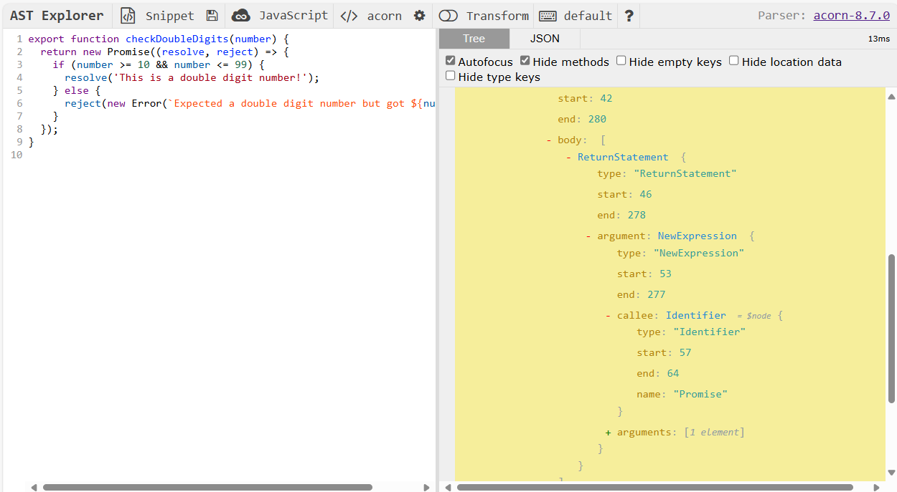

# Static Code Analysis

Static code analysis is a technique used to analyze code without executing it. In the context of the exercises in the assignment repositories, static code analysis can be used to verify that the exported functions meet certain criteria or follow specific patterns.

More sophisticated unit tests can use static code analysis to inspect the actual code of the exported function. For instance, in the `checkDoubleDigits` exercise we expect a new `Promise` to be created and `resolve()` and `reject()` to be called with a single parameter each. There is no way to check this from the runtime context. Here, static code analysis can come to the rescue.

First of all (and this goes for exercises to be unit-tested), we must have a working model solution to analyze. For instance:

```js
export function checkDoubleDigits(number) {
  return new Promise((resolve, reject) => {
    if (number >= 10 && number <= 99) {
      resolve('This is a double digit number!');
    } else {
      reject(new Error(`Expected a double digit number but got ${number}`));
    }
  });
}
```

We can use the online [AST Explorer](https://astexplorer.net/) to examine the AST of a model solution. This is illustrated in Figure 1 below. The AST tree is actually a large, hierarchical JavaScript/JSON object that consists of **ESTree** "nodes".

> See [ESTree Spec](https://github.com/estree/estree). Of most interest are [es5.md](https://github.com/estree/estree/blob/master/es5.md) and [es2015.md](https://github.com/estree/estree/blob/master/es2015.md).

By expanding and examining the nodes in the AST we can see that we can expect a `NewExpression` node with a `callee.name` of `"Promise"`. Descending further down this node we can find two `CallExpression` nodes, with `callee.name` properties of `resolve` and `reject` respectively, each with an `arguments` array of length 1.

The callback function passed to `beforeAll` walks down the AST tree using the `simple()` function imported from `acorn-walk`. This function visits each node in the AST tree and will call a handler for each node if present in the object passed as its second parameter. We simply record facts of interest in a `state` object that we can subsequently inspect in individual `test()` functions.

```js
// ...
type State = {
  newPromise?: boolean;
  resolve?: number;
  reject?: number;
  [key: string]: any;
};

describe('api-wk1-ex2-checkDoubleDigits', () => {
  const state: State = {};

  let exInfo: ExerciseInfo;

  let checkDoubleDigits: (num: number) => Promise<string>;

  beforeAll(async () => {
    exInfo = await beforeAllHelper(__filename);

    checkDoubleDigits = exInfo.module?.checkDoubleDigits;

    exInfo.rootNode &&
      simple(exInfo.rootNode, {
        NewExpression({ callee }) {
          if (callee.type === 'Identifier' && callee.name === 'Promise') {
            state.newPromise = true;
          }
        },
        CallExpression({ callee, arguments: args }) {
          if (
            callee.type === 'Identifier' &&
            ['resolve', 'reject'].includes(callee.name)
          ) {
            state[callee.name] = args.length;
          }
        },
      });
  });

  test('should call new Promise()', () => {
    expect(state.newPromise).toBeDefined();
  });

  test('`resolve()` should be called with one argument', () => {
    expect(state.resolve).toBe(1);
  });

  test('`reject()` should be called with one argument', () => {
    expect(state.reject).toBe(1);
  });

```


Figure 1: AST (Abstract Syntax Tree) of the function `checkDoubleDigits`.
