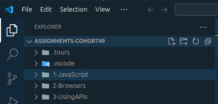
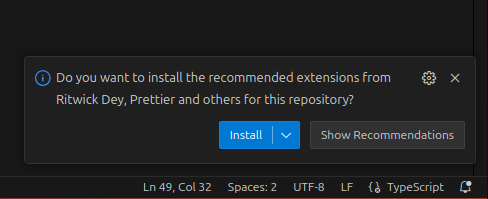
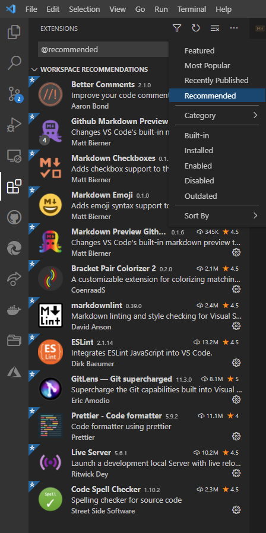
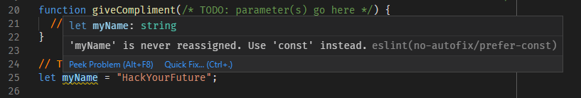
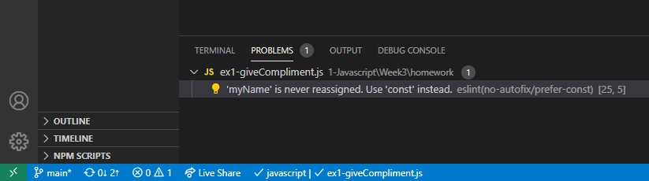
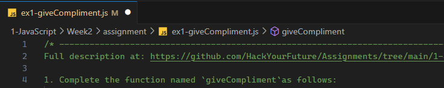

# Setup Instructions for HackYourFuture Assignments

## Introduction

This document provides instructions on how to set up your development environment for the HackYourFuture assignments. It covers the setup of VS Code, and the necessary extensions, as well as how to run and test your code.

## VS Code Setup

You will be spending a lot of time working in [VS Code](https://code.visualstudio.com/) during the HackYourFuture curriculum. If you are new to VS Code please check out the [VS Code Tips](https://github.com/HackYourFuture/fundamentals/blob/master/VSCodeTips/README.md) before continuing.

From the command line, you can start VS Code by typing the command `code` followed by a space and the name of the folder you want to open. For example, to open the `my-project` folder, type:

```text
code my-project
```

Alternatively, you can `cd` into the `my-project` folder, and can just type:

```text
code .
```

Note that the name of the folder opened in VS Code can always be found in the `EXPLORER` panel ( in the example below: `ASSIGNMENTS_COHORT49` in the picture below):



### Install Recommended VS Code Extensions

**Important**: When you open the repository for the first time you may see the dialog box shown below that invites you to install a set of **recommended VS Code extensions**. These extensions will provide useful help and guidance when you are creating and editing files in VS Code. **Please install these extensions when invited to do so.**



If, for some reason, the prompt to install the extensions does not appear then please install the extensions manually (click on the triangle below for details).

<details>
  <summary>Manual installation</summary>

<br>If for some reason you do not see the VS Code message box inviting you to install the recommended extensions you can do so manually by clicking the **Extensions** button in the VS Code sidebar, pressing the **Filter** button and then selecting **Recommended** from the drop-down menu as shown in the figure below. Please install all extensions listed under the **Workspace Recommendations** header.



</details>

### Prettier VS Code Extension

This is a recommended VS Code extension that we have included in this repository. **Prettier** is an automatic code formatter to make your code look "pretty". However, it is not just that your code is made pretty, it formats your code into a popular standard that has become well established in the JavaScript community. Other developers, whether trainees, mentors or, later, your colleagues will thank you for using it.

> Ensure that you do not install any other code formatter extensions, for example, **Beautify**, in addition to Prettier. This may cause formatting conflicts.

### ESLint VS Code Extension

Another recommended extension is we have included is **ESLint**. This tool will check your code for _coding style_ errors. Style errors will not necessarily prevent your code from running correctly. However, they indicate that your code does not conform to a preferred coding style. For instance, if you define a variable using the `let` keyword and you do not reassign that variable elsewhere in your code then ESLint will warn you to replace `let` with `const`. In Figure 4 below you can see that the variable name `myName` has a squiggly colored underline. If you hover your mouse over the variable a pop-up window will appear.


<br>Figure 4. ESLint warnings

You can also inspect the **Problems** pane or the left hand size of the VS Code status bar to see whether any problems have been detected, as shown in Figure 5.


<br>Figure 5. VS Code Problems Pane

### Code Spell Checker

A further extension that we have included is a spell checker that understands code. It particularly understands that variable, property and function names are often multi-word names that use **camelCase**, **PascalCase**, **snake_case** or **kebab-case**. When it checks for spelling errors it knows how to break up these multi-word names before checking the broken down words against its dictionary. Spelling mistakes are indicated by squiggly underlines and also reported in the Problems pane.

> Take pride in the correct spelling in your code. It is a sign of professionalism!

## GitHub Classroom Assignments

The assignments can be found in the `assignment` folder. It contains files and (sometimes) sub-folders that make up the exercises. The exercises consist of starter files that you need to complete. Some exercises consist of a single JavaScript (for example, `ex1.js`). Exercises that are browser-based are mostly contained in sub-folders (for example, `ex1` in the `assignment` folder).

> You should not change anything in the `unit-tests` sub-folder. The purpose of this folder will be explained later.

As mentioned, each exercise comes with starter code. Inside the starter code you will find comments that indicate the places where there is something for you to do. For example, in the code of the JavaScript file `ex1-giveCompliment.js` as shown in Figure 2 this is:

1. The **parameter list** (if needed, for you to figure out) of the function `giveCompliment`.
2. The **function body** of `giveCompliment`.
3. The **value** of the variable `myName`.

```js
export function giveCompliment(/* TODO parameter(s) go here */) {
  // TODO complete this function
}

function main() {
  // TODO substitute your own name for "HackYourFuture"
  const myName = 'HackYourFuture';

  console.log(giveCompliment(myName));
  console.log(giveCompliment(myName));
  console.log(giveCompliment(myName));

  const yourName = 'Amsterdam';

  console.log(giveCompliment(yourName));
  console.log(giveCompliment(yourName));
  console.log(giveCompliment(yourName));
}

// ! Do not change or remove the code below
if (process.env.NODE_ENV !== 'test') {
  main();
}
```

Figure 2. Starter code example: file `ex1.js`.

In general, you should only change or add code in the places indicated by the `// TODO` comments. Once you have implemented what the `// TODO` comment asks you to do, remove the `// TODO` comment itself.

You should not delete or rename existing function(s), nor should you change the file names of the starter files. This repository comes with an automated test facility that relies on the presence of these files and functions.

You _are_ allowed to add additional functions and/or global variables (but avoid global variables if you can).

When you are in the process of making changes to a file you will notice a dot or bullet appearing after the file name in the tab of the editor window, as shown in Figure 4 below:


<br>Figure 3. Unsaved changes

This indicates that you have unsaved changes. Once you are done, you can use the **File**, **Save** menu commands (or a keyboard shortcut) to save the changes. However, in this repository we have included a setting that automatically saves changes for you whenever you click away from the editor window.

> If you are curious about the VS Code settings that we included in this repository, check the file `settings.json` in the `.vscode` folder. The setting we mentioned in the previous paragraph is: **"files.autoSave": "onFocusChange"**.
>
> You can learn more about VS Code settings here: [User and Workspace Settings](https://code.visualstudio.com/docs/getstarted/settings).

### Running the Exercises

To run the exercises in Node.js, `cd` into the `assignment` folder and use the following command:

```bash
node <exercise-file-name>.js
```

For example, to run the first exercise, use:

```bash
node ex1.js
```

> Tip: You can use autocompletion in your terminal to quickly find the exercise files. Start typing `node ex1` and then press the Tab key to let the terminal complete the file name with `.js` for you.

This will run the code and any `console.log` statement will print in the terminal window. The unmodified code example will just print:

```text
❯ node .\ex1.js
undefined
undefined
undefined
```

It is now up to you to complete the code so that it, perhaps, produces something like:

```text
❯ node .\ex1.js
You are lovely, HackYourFuture!
You are great, HackYourFuture!
You are awesome, HackYourFuture!
```

### Running Unit Tests

To ensure your code works as expected, we have provided unit tests for each exercise. You can run these tests using [Jest](https://jestjs.io/), which is already set up in the project.

```bash
npx jest <exercise-file-name>
```

For example, to run the unit test for the first exercise, use:

```bash
npx jest ex1
```

The unit tests will check if your implementation meets the requirements specified in the exercise description. If all tests pass, you can be confident that your solution is functionally correct.

These same unit tests will be used to evaluate your submission, so make sure they pass before submitting your assignment.
